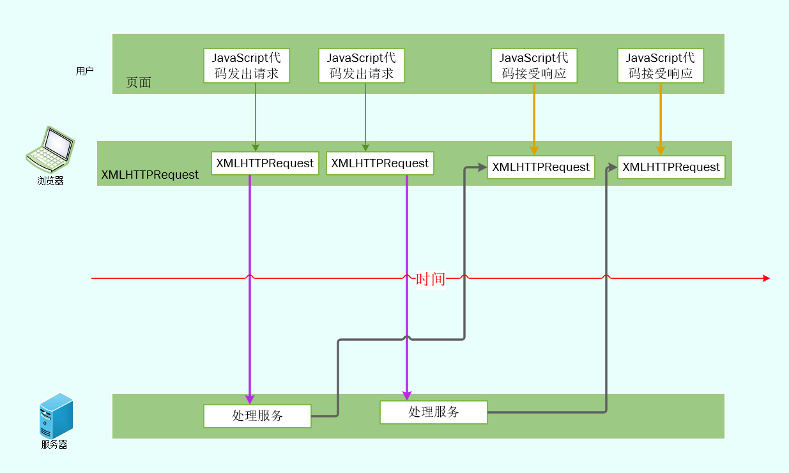
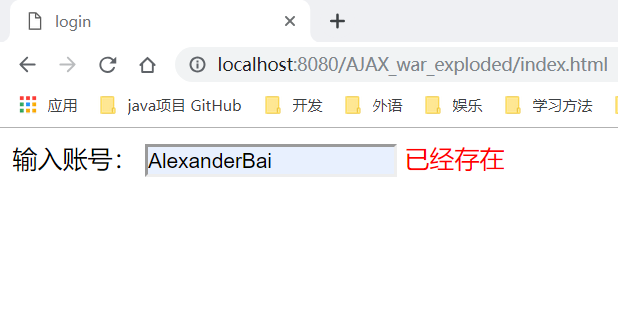
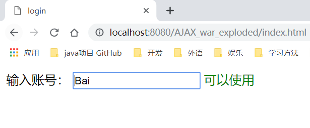
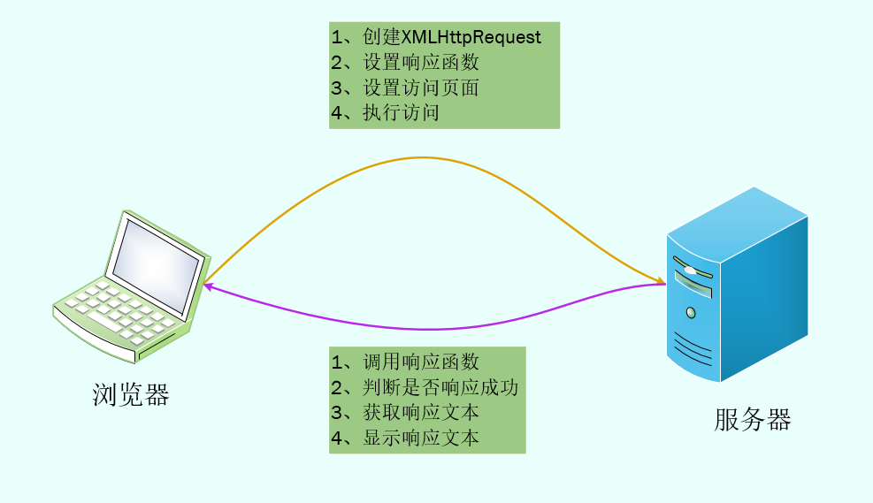

## 一、什么是AJAX

>- 在此之前，点击一个按钮，页面就要刷新一下，尽管页面只有一行甚至一个字不一样，但还是要无聊地等待刷新（全局）。
>
>- 使用AJAX之后，点击页面，页面本身不用刷新，只需加载改变的部分（局部刷新）。

#### 1、全名

Ajax(Asynchronous JavaScript and XML)：异步JavaScript和XML

异步传输+js+xml

- **异步传输**：向服务器发送请求时，不必等待结果，可以同时做其他事，等到有了结果可以在来处理这个事（与同步相对）
- AJAX的异步传输使得AJAX具有局部刷新功能

## 二、为什么使用AJAX

因为AJAX具有局部刷新的功能




## 三、编写第一个AJAX程序

####1、代码说明

**写一个AJAX小程序用于检验提交的用户是否存在。若提交的数据为“AlexanderBai”就打印存在，否则打印可用**

- index.html：表单页面

  ```html
  <!DOCTYPE html>
  <html lang="en" xmlns="http://www.w3.org/1999/html">
  <head>
      <meta charset="UTF-8">
      <title>login</title>
  </head>
  <body>
      <span>输入账号：</span>
      <input id="name" name="name" onkeyup="check()" type="text"/>
      <span id="checkResult"></span> <!--用于接受服务器传递回来的数据-->
      <script>
          var xmlHttp;
          function check() {
              var name=document.getElementById("name").value;
              var url = "http://localhost:8080/AJAX_war_exploded/checkName.jsp?name=" + name;
              //创建XML Http Request（XHR）对象
              //XHR对象是一个JavaScript对象，他可以在用户没有感觉的情况下，
              // 就像本后运行的一个小线程，悄悄地和服务器器进行数据交互，AJAX就是通过它做到无刷新效果的
              xmlHttp = new XMLHttpRequest();
              //设置响应函数，指定函数checkResult处理从服务器中获得的响应
              xmlHttp.onreadystatechange = checkResult;
              //设置背后的一个小线程，指定将要访问的URL
              xmlHttp.open("GET", url, true);
              //进行实际的访问，在这里参数已经通过get方式，放在URL里了。
              //只有在用post且需要放松参数的时候，才会用到send，类似xmlHttp.send("user="+name+"&password="+password);
              xmlHttp.send(null);
          }
          function checkResult() {
              //xmlHttp.readyState 4表示请求完成
              //xmlHttp.readyState 200 表示响应成功
              if (xmlHttp.readyState == 4 && xmlHttp.status == 200) {
                  //document.getElementById('checkResult').innerHTML 设置span的内容为服务器传递回来的文本
                  document.getElementById('checkResult').innerHTML = xmlHttp.responseText;
              }
          }
      </script>
  </body>
  </html>
  ```

- check.jsp ：后台验证业务

  ```jsp
  <%--
    Created by IntelliJ IDEA.
    User: AlexanderBai
    Date: 2019/4/22
    Time: 16:15
    To change this template use File | Settings | File Templates.
  --%>
  <%@ page contentType="text/html;charset=UTF-8" language="java" %>
  <html>
  <head>
      <title>checkName</title>
  </head>
  <body>
      <%
          String name = request.getParameter("name");
          if ("AlexanderBai".equals(name)) {
              out.println("<font color='red'>已经存在</font>");
          } else {
              out.println("<font color='green'>可以使用</font>");
          }
      %>
  </body>
  </html>
  ```

- 运行效果

  

  

  **以上的演示没有用到刷新，但是能看到修改后的渲染效果，这就是AJAX的功能**

#### 2、原理说明

