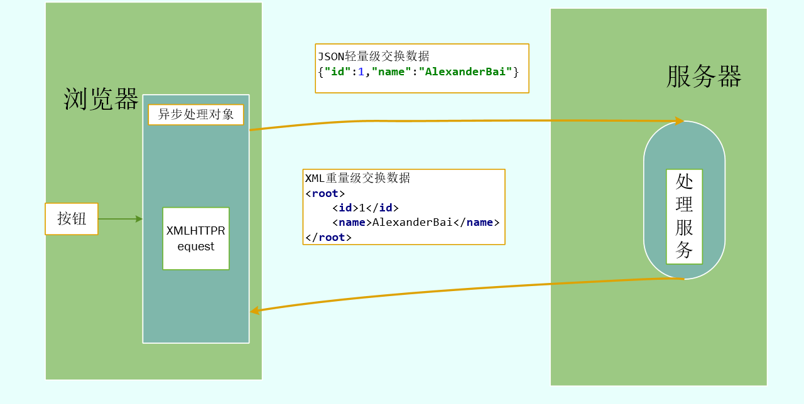
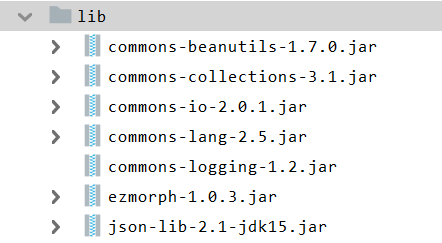

##一、认识JSON

####1、JSON

- JavaScript对象表示法（**J**ava**S**cript **O**bject **N**otation）是一种存储数据和交换文本信息的语法。

- JSON采用完全独立于任何程序语言的文本格式，使json成为理想的数据交换语言。

- 一个web项目，当后台的代码获取了数据库的数据之后，会把这些数据存放在JSON中，由JSON负责把数据转交给前台的AJAX

####2、JSON与XML区别

- JavaScript原生支持json，解析速度更快
- 更加容易创建JavaScript对象
- JSON相比XML是轻量级数据交换技术



  

  

##二、JSON语法

客户端与服务器交互数据无非就是两种

- 数组

- 对象

JSON用来存储和交互数据，所表示的对象要么就是数组，要么就是对象

#### 1、JSON数组

```json
var employees=[
	{"id":1,"name":"AlexanderBai"},
	{"id":2,"name":"XiXi"}
];
```

#### 2、JSON对象

```json
 var obj={
      age:20,
      str:"AlexanderBai",
      method:function () {
      	alert("Forever")
      }           
 };
```


##三、解析JSON

- 解析JSON：即读取JSON所表示的数据
- 使用JavaScript原生方式解析JSON，调用eval()函数来解析JSON，把JSON文本数据转化为一个JavaScript对象

```json
<script>
        function test() {
            var text = "{a:123," +
                "b:'AlexanderBai'}";
        }
        var aa = eval("(" + test() + ")");
        alert(aa);
</script>  
```


##四、JSON对象转换

- 许多框架自带的一些组件能把JavaBean对象、List、Set、Map集合转换为JSON对象

- 写一个不使用框架，使用第三方工具的JSON对象转换程序

- 导入JAR

  

```java
package com.alexanderbai.bean2json;

import net.sf.json.JSONArray;

import java.util.*;

/**
 * @Description TODO
 * @Author AlexanderBai
 * @Data 2019/4/22 20:43
 **/
public class TestBean2Json {
    private static void javaBean2Json() {
        City city = new City(1, "广州");
        JSONArray jsonArray=JSONArray.fromObject(city);
        String jsonJAVA=jsonArray.toString();
        System.out.println(jsonJAVA);
    }

    private static void list2Json() {
        List<City> cityList = new ArrayList<>();
        cityList.add(new City(1, "广州"));
        cityList.add(new City(2, "珠海"));
        JSONArray jsonArray=JSONArray.fromObject(cityList);
        String jsonJAVA=jsonArray.toString();
        System.out.println(jsonJAVA);
    }

    private static void set2Json() {
        Set<City> citySet = new LinkedHashSet<>();
        citySet.add(new City(1, "广州"));
        citySet.add(new City(2, "珠海"));
        JSONArray jsonArray=JSONArray.fromObject(citySet);
        String jsonJAVA = jsonArray.toString();
        System.out.println(jsonJAVA);
    }

    private static void javaBeanList2Json() {
        List<City> cityList = new ArrayList<>();
        cityList.add(new City(1, "中山"));
        cityList.add(new City(2, "佛山"));
        Province province = new Province(1, "广东", cityList);
        JSONArray jsonArray=JSONArray.fromObject(province);
        String jsonJAVA=jsonArray.toString();
        System.out.println(jsonJAVA);
    }

    private static void map2Json() {
        List<City> cityList = new ArrayList<>();
        cityList.add(new City(1, "中山"));
        cityList.add(new City(2, "佛山"));
        Map<String, Object> map = new LinkedHashMap<>();
        map.put("total", cityList.size());
        map.put("rows", cityList);
        JSONArray jsonArray=JSONArray.fromObject(map);
        String jsonJAVA=jsonArray.toString();
        System.out.println(jsonJAVA);
        jsonJAVA=jsonJAVA.substring(1, jsonJAVA.length() - 1);
        System.out.println(jsonJAVA);
    }
    
//为了操作简洁，在此定义类
static class City {
        private int id;
        private String name;
        public City(int id, String name) {
            this.id = id;
            this.name = name;
        }

    @Override
    public String toString() {
        return "City{" +
                "id=" + id +
                ", name='" + name + '\'' +
                '}';
    }
}

static class Province {
        private int id;
        private String name;
        List<City> cityList;

        Province(int id, String name, List<City> cityList) {
        this.id = id;
        this.name = name;
        this.cityList = cityList;
    }

    @Override
    public String toString() {
        return "Province{" +
                "id=" + id +
                ", name='" + name + '\'' +
                ", cityList=" + cityList +
                '}';
    }
}

    public static void main(String[] args) {
        javaBean2Json();      System.out.println("============================================================");
        list2Json();
        System.out.println("============================================================");
        set2Json();
        System.out.println("============================================================");
        javaBeanList2Json();
        System.out.println("============================================================");
        map2Json();
    }
}
```


