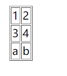
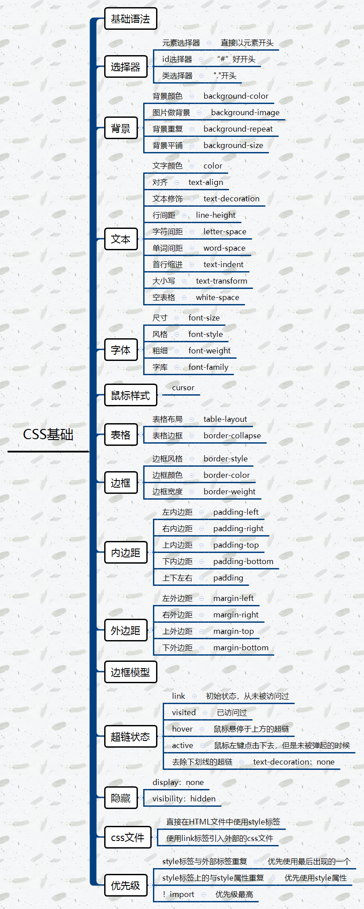
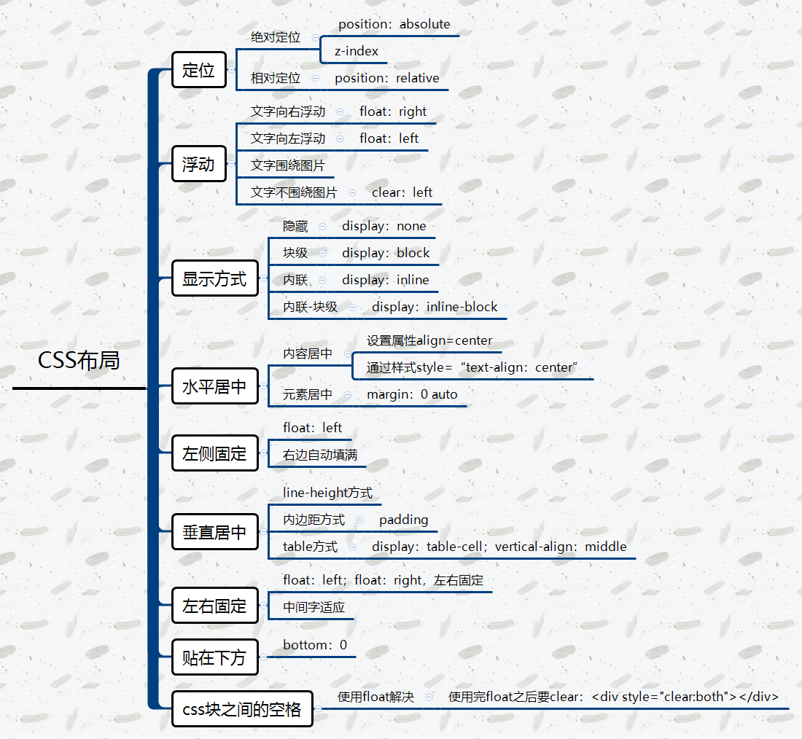

### 一、HTML

####1、认识HTML

- HTML标签

  - HTML由一套标记标签组成，通常叫做标签

    

  - | <p>  |  <h1>  |
    | :--: | :----: |
    | <br> | <span> |

- HTML元素

  - 指从开始标签到结束标签之间的所有代码

  - 完整的标签

    - ```html
      <h1>一级标题<h1>
      ```

  - 不完整的标签

    - ```html
      <h1>标题标签没有结束
      ```

  - 特殊的标签

    - 有的特殊的标签，没有内容，即开始和结束直接放在一起

    - ```html
      <br>
      <hr>
      ```

- HTML属性

  - 属性是要来修饰标签，如设置标题居中

  - ```html
    <h1 align="center">居中标题</h1>
    ```

    - **align**是属性名，**center**是属性值

- HTML注释

  - 使用<!--  -->进行注释

####2、基本元素

- HTML标题

  - h1至h6大小依次缩小的标题

- HTML段落

  - ```html
    <p>标签段落，会自动换行
    ```

- HTML字体

  - ```
    使用<font>标签表示字体
    ```

- HTML斜体

  - ```HTML
    <i>和<em>都可以表示斜体效果
    ```

- HTML粗体

  - ```html
    <b>标签表示粗体，b是blood的缩写
    <strong>标签表示粗体
    ```

- HTML预格式

  - 有时需要在网页上显示原生的代码，这时就需要<pre>标签

  - ```html
    <p>这里是没有用预格式的情况：</p>
    
    public class HelloWorld {
    
    	public static void main(String[] args) {
    		System.out.println("Hello World");
    	}
    }
    
    <br/>
    <br/>
    
    <p>使用预格式的情况:</p>
    
    <pre>
    public class HelloWorld {
    
    	public static void main(String[] args) {
    		System.out.println("Hello World");
    	}
    }
    
    </pre>
    
    ```

- HTML删除效果

  - ```
    <del>标签表示删除效果
    ```

- HTML下划线

  - ```
    <ins>标签表示下划线效果
    ```

- HTML图像

  - 标签表示图像

  - ```html
    
    ```

- HTML超链接

  - <a>标签表示超链接

  - ```
    <a href="URL">超链接描述</a>
    ```

- HTML表格

  - ```HTML
    <table>表示一个表格
    <tr>表示行
    <td>表示列，又叫单元格
    ```

    - ```html
      <table>
        <tr>
            <td>1</td>
            <td>2</td>
        </tr>
       
        <tr>
            <td>3</td>
            <td>4</td>
        </tr>
      
        <tr>
            <td>a</td>
            <td>b</td>
        </tr>
       
      </table>
      ```

      - 运行效果：
        - 

  - 可以设置td的属性colspan（横跨两列，水平合并）或rowspan(竖跨两行，垂直合并)

- HTML列表

  - 无序 <ul>
  - 有序 <ol>
  - 列表 <li>

- HTML 块 div span

  - div一般使用css样式进行布局
  - span是内联元素。不换自动换行

- HTML内联框架

  - **<iframe>通过内联框架可以向网页中插入网页**

  - ```html
    <iframe src="http://how2j.cn/" width="600px" height="400px">
    </iframe>
    ```

 #### 3、表单元素

- HTML文本框

- HTML密码框

- HTML表单

- HTML单选框

- HTML多选框

- HTML下拉列表

- 文本域

- HTML普通按钮

- HTML提交按钮

- HTML重置按钮

- HTML图像提交

- HTML按钮

- demo

  ```html
  
  <html>
  <head>
      <meta http-equiv="Content-Type" content="text/html; charset=GBK">
  </head>
  <body>
  
  
  <table width="100%">
      <tbody><tr>
          <td align="right"><font color="#FF0000">*</font>用户名:</td>
          <td><input type="text" size="30"> <font color="red">用户名不得小于3个字符</font></td>
      </tr>
      <tr>
          <td align="right"><font color="#FF0000">*</font>密码:</td>
          <td><input name="text" type="text" size="30"></td>
      </tr>
      <tr>
          <td align="right"><font color="#FF0000">*</font>确认密码:</td>
          <td><input name="text2" type="text" size="30"></td>
      </tr>
      <tr>
          <td align="right"><font color="#FF0000">*</font>Email:</td>
          <td><input name="text3" type="text" size="30"></td>
      </tr>
      <tr>
          <td align="right"><font color="#FF0000">*</font>真实姓名:</td>
          <td><input name="text4" type="text" size="30"></td>
      </tr>
      <tr>
          <td align="right"><font color="#FF0000">*</font>性别:</td>
          <td>
              <select>
                  <option>男</option>
                  <option>女</option>
              </select>
          </td>
      </tr>
      <tr>
          <td align="right"><font color="#FF0000">*</font>生日:</td>
          <td><select name="select">
              <option>1980</option>
              <option>1981</option>
              <option>1982</option>
              <option>1983</option>
              <option>1984</option>
              <option>1985</option>
              <option>1986</option>
              <option>1987</option>
              <option>1988</option>
              <option>1989</option>
              <option>1990</option>
              <option>1991</option>
          </select>
              <select name="select2">
                  <option>1</option>
                  <option>2</option>
                  <option>...</option>
                  <option>12</option>
              </select>
              <select name="select3">
                  <option>1</option>
                  <option>2</option>
                  <option>...</option>
                  <option>31</option>
              </select></td>
      </tr>
      <tr>
          <td align="right"><font color="#FF0000">*</font>手机:</td>
          <td><input name="text7" type="text" size="30"></td>
      </tr>
      <tr>
          <td align="right"><font color="#FF0000">*</font>居住地:</td>
          <td><select name="select4">
              <option>四川省</option>
              <option>河南省</option>
              <option>广东省</option>
              <option>河北省</option>
              <option>黑龙江省</option>
              <option>海南省</option>
              <option>安徽省</option>
              <option>内蒙古省</option>
              <option>广西省</option>
              <option>湖南省</option>
              <option>湖北省</option>
              <option>浙江省</option>
          </select>
              <select name="select5">
                  <option>成都市</option>
                  <option>重庆市</option>
                  <option>...</option>
                  <option>北京市</option>
              </select> <select name="select6">
                  <option>成华区</option>
                  <option>龙泉驿区</option>
                  <option>...</option>
                  <option>金牛区</option>
              </select> <select name="select7">
                  <option>三圣乡</option>
                  <option>星辉路</option>
                  <option>...</option>
                  <option>蜀都大道</option>
              </select></td>
      </tr>
      <tr>
          <td align="right"><font color="#FF0000">*</font>QQ:</td>
          <td><input name="text9" type="text" size="30">
              <br>
              <font size="-1" color="#0099FF">设置我的QQ在线状态</font>
          </td>
      </tr>
      </tbody></table>
  
  
  </body></html>
  ```

####4、HTMl DOM


### 二、CSS

#### 1、基础

- 语法

- 选择器
  - 元素选择器
  - id选择器"#"
  - 类选择器

- 注释

- 尺寸

- 文本

- 字体

  - 尺寸

  ```html
  <!
  <html>
  <head>
      <meta charset="UTF-8">
      <meta name="viewport"
            content="width=device-width, user-scalable=no, initial-scale=1.0, maximum-scale=1.0, minimum-scale=1.0">
      <meta http-equiv="X-UA-Compatible" content="ie=edge">
      <title>Document</title>
  </head>
  <body>
      <style>
          p.big{
              font-size: 30%;
          }
          p.small{
              font-size: 50%;
          }
          p.small2{
              font-size: 0.5em;
          }
      </style>
      <p>正常大小</p>
      <p class="big">30%px大小的文字</p>
      <p class="small">50%比例的文字</p>
      <p class="small2">0.5em 等同于50%比例的文字</p>
  </body>
  </html>
  ```

  - 风格

    ```html
    <!
    <html>
    <head>
        <meta charset="UTF-8">
        <meta name="viewport"
              content="width=device-width, user-scalable=no, initial-scale=1.0, maximum-scale=1.0, minimum-scale=1.0">
        <meta http-equiv="X-UA-Compatible" content="ie=edge">
        <title>Document</title>
    </head>
    <body>
        <style>
            p.n{
                font-style: normal;
            }
            p.i{
                font-style: italic;
            }
        </style>
        <p>标准字体</p>
        <p class="n">标准字体</p>
        <p class="i">斜体</p>
    </body>
    </html>
    ```

  - 粗细

    ```html
    <!
    <html>
    <head>
        <meta charset="UTF-8">
        <meta name="viewport"
              content="width=device-width, user-scalable=no, initial-scale=1.0, maximum-scale=1.0, minimum-scale=1.0">
        <meta http-equiv="X-UA-Compatible" content="ie=edge">
        <title>Document</title>
    </head>
    <body>
        <style>
            p.n{
                font-weight: normal;
            }
            p.i{
                font-weight: bold;
            }
        </style>
        <p>标准字体</p>
        <p class="n">标准字体</p>
        <p class="i">粗一点</p>
    </body>
    </html>
    ```

    

- 鼠标样式

  ```html
  <!
  <html>
  <head>
      <meta charset="UTF-8">
      <meta name="viewport"
            content="width=device-width, user-scalable=no, initial-scale=1.0, maximum-scale=1.0, minimum-scale=1.0">
      <meta http-equiv="X-UA-Compatible" content="ie=edge">
      <title>Document</title>
  </head>
  <body>
      <style>
          span{
              cursor: crosshair;
          }
      </style>
      <span>鼠标移动这段文字上，就看到鼠标样式变成了十字架</span>
  </body>
  </html>
  ```

- 表格

  - 表格布局

    ```html
    <!
    <html>
    <head>
        <meta charset="UTF-8">
        <meta name="viewport"
              content="width=device-width, user-scalable=no, initial-scale=1.0, maximum-scale=1.0, minimum-scale=1.0">
        <meta http-equiv="X-UA-Compatible" content="ie=edge">
        <title>Document</title>
    </head>
    <body>
        <style>
            table.t1{
                table-layout: auto;
            }
            table.t2{
                table-layout: fixed;
            }
        </style>
        <table class="t1" border="1" width="100%">
            <tr>
                <td width="10%">abcdefghijklmnopqrstuvwxyz</td>
                <td width="90%">abc</td>
            </tr>
        </table>
        <table class="t2" border="1" width="100%">
            <tr>
                <td width="50px">abcdefghijkrmnopqrstuvwxyz</td>
                <td>abc</td>
            </tr>
        </table>
    </body>
    </html>
    ```

    

  - 表格边框

    ```html
    <!
    <html>
    <head>
        <meta charset="UTF-8">
        <meta name="viewport"
              content="width=device-width, user-scalable=no, initial-scale=1.0, maximum-scale=1.0, minimum-scale=1.0">
        <meta http-equiv="X-UA-Compatible" content="ie=edge">
        <title>Document</title>
    </head>
    <body>
        <style>
            table.t1{
                border-collapse: separate;
            }
            table.t2{
                border-collapse: collapse;
            }
        </style>
        <table class="t1" border="1" width="200px">
            <tr>
                <td width="50%">边框分离</td>
                <td width="50%">边框分离</td>
            </tr>
        </table>
        <table class="t2" border="1" width="200px">
            <tr>
                <td width="50%">边框合并</td>
                <td width="50%">边框合并</td>
            </tr>
        </table>
    </body>
    </html>
    ```

- 边框

  - 边框风格

  ```html
  <!
  <html>
  <head>
      <meta charset="UTF-8">
      <meta name="viewport"
            content="width=device-width, user-scalable=no, initial-scale=1.0, maximum-scale=1.0, minimum-scale=1.0">
      <meta http-equiv="X-UA-Compatible" content="ie=edge">
      <title>Document</title>
  </head>
  <body>
      <style>
          .solid{
              border-style: solid;
          }
          .dotted{
              border-style: dotted;
          }
          .dashed{
              border-style: dashed;
          }
          .double{
              border-style: double;
          }
      </style>
      <div>默认无边框</div><br/>
      <div class="solid">实线边框</div><br/>
      <div class="dashed">点状边框</div><br/>
      <div class="double">双实线边框</div><br/>
  </body>
  </html>
  ```

  - 边框颜色

    ```html
    <!
    <html>
    <head>
        <meta charset="UTF-8">
        <meta name="viewport"
              content="width=device-width, user-scalable=no, initial-scale=1.0, maximum-scale=1.0, minimum-scale=1.0">
        <meta http-equiv="X-UA-Compatible" content="ie=edge">
        <title>Document</title>
    </head>
    <body>
        <style>
            .red {
                border-style: solid;
                border-color: red;
            }
    
        </style>
        <div>默认无边框div</div><br/>
        <div class="red">实线边框</div><br/>
    </body>
    </html>
    ```

    

- 外边框

- 边框模型

- 超链状态

- 隐藏

- css文件

- 优先级



####2、布局

- 绝对定位
- 相对定位
- 浮动
- 显示方式
- 水平居中
- 左侧固定
- 垂直居中
- 左右固定
- 贴在下方
- 块间空格



- 练习

  ```html
  <html>
  <head>
      <meta http-equiv="Content-Type" content="text/html; charset=GB2312">
  </head>
  
  <style>
      body{
          font-family:"宋体";
          font-size:13px;
          color:#666666;
          width:643px;
      }
  
      .bold{
          font-weight:bold;
      }
  
      div.topdiv{
          border-bottom-style:solid;
          border-bottom-color:silver;
          border-bottom-width:1px;
          padding-bottom:10px;
          margin-bottom:15px;
      }
      .floatright{
          float:right;
      }
  
      .floatleft{
          float:left;
      }
  
      .show{
          border:1px solid red;
      }
  
      div1{
          border:1px solid green;
      }
  
      a{
          text-decoration: none;
          color:#336699;
      }
      .text{
          color:#333;
      }
  
      div#thirdDiv span{
          color:darkgray;
      }
  
      div.clearLeft{
          clear:left;
      }
  
  </style>
  
  <body>
  <div class="topdiv">
      
      <span class="bold">最新动态</span>
      <span  class="floatright" >设置</span>
      
  </div>
  
  
  <div id="left" class="floatleft" style="margin-right:15px">
       <br>
      <br>
      <span style="background-image:url(image/5.png); padding:5px">6551</span>
  </div>
  
  <div id="right" class="floatleft show1">
      <div style="margin-bottom:5px">
          <span>热门回答，来自 机械</span>
          <a href="#">关注话题</a>
          
      </div>
      <a class="bold">人类史上令人叹为观止的极限精度制造成果有哪些？</a>
      <p class="text"><strong>Vincent Fu</strong>, Materials Science, PhD</p>
      
      <div  class="floatleft text" style="line-height:170%;margin-left:15px;width:367px">
  
      说到精度，就不得不提在材料学中最重要的一个方面：表征。要项研究一种材料性能，握在手里把玩时远远不够的，就算你拿出放大镜离近了看，也只能看到表面的一些坑坑洼洼，
      而为了知晓一种材料的纤维结构，科学家至少要下到纳米级（放大千倍），如果要获得更深...
  
      <a href="">显示全部 </a>
      <br>
      &nbsp;
  </div>
  
  <div id="thirdDiv">
      
      <span>关注问题</span>
      
      <span>867条评论</span>
      
      <span>作者保留权利</span>
  </div>
  </div>
  <div class="clearLeft" >
  </div>
  <div id="bottom" style="margin-top:20px;border-top-style:solid;border-top-width:1px;border-top-color:#ddd">
  </div>
  
  
  </body>
  </html>
  ```

  

### 三、JavaScript

#### 1、语言基础

- script标签
- 注释
- 变量
- 调试方法
- 基本数据类型
- 函数
- 作用域
- 事件
- 算数运行符
- 逻辑运算符
- 条件运算符
- 条件语句
- 循环语句
- 错误处理

#### 2、对象

- 数字
- 字符串
- 数组
- 日期
- Math
- 自定义对象

#### 3、BOM（Browser Object Model）

- Window
- Navigator
- Screen
- History
- Location
- 弹出框
- 计时器

